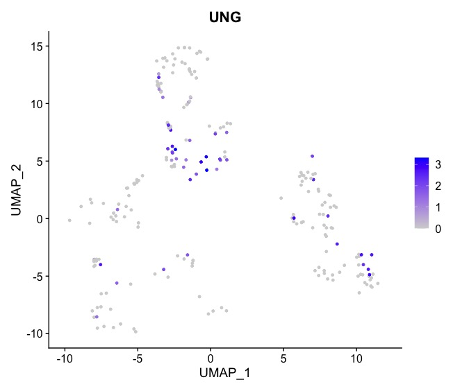
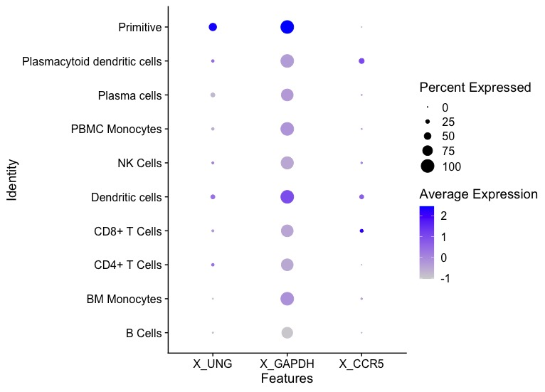
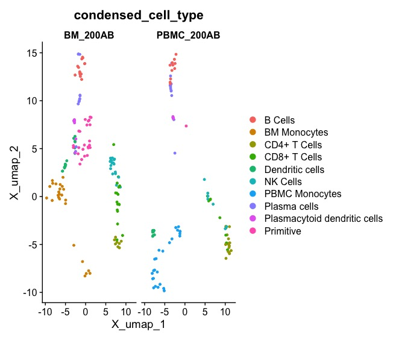
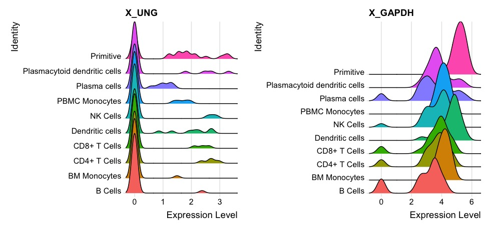
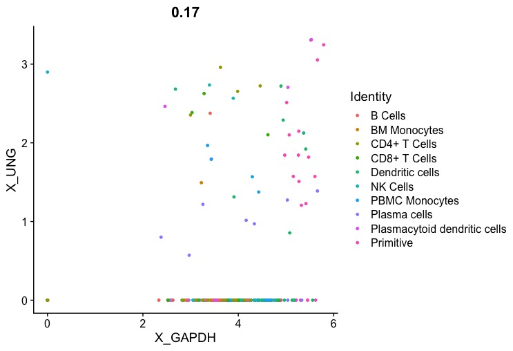
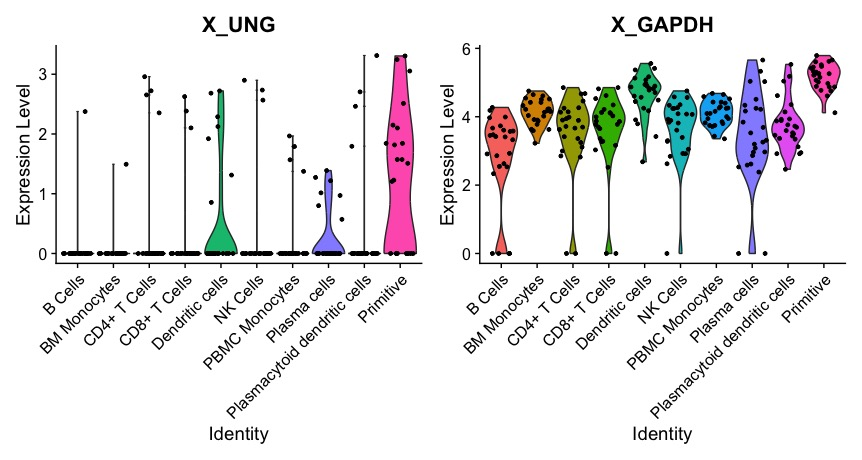

# SCUBA

###  *S*ingle *C*ell *U*nified *B*ack end *A*PI 

SCUBA is a unified data accession interface for single cell data formats. The package pulls data from Seurat, SingleCellExeriment, and Anndata objects for use in downstream plotting and analysis. Plotting functions that produce Seruat-style plots from all three object formats are also included.

### Pre-requisites

SCUBA relies on the [reticulate](https://rstudio.github.io/reticulate/) package to operate on AnnData objects. Please make sure you follow the instructions on the reticulate page before moving on.  

It is recommended to use conda environments to manage your python version that is being used by reticulate. A conda environment can be used on the current R session by using `reticulate::use_condaenv()`. If you want to make it automatically load on startup you can select your conda environment in RStudio > Options > Python. 

You must have the following packages installed and available in your python environment:
- Numpy
- Scipy
- Pandas
- AnnData

### Installation

```
remotes::install_github("amc-heme/SCUBA")
```


### Working with different objects in SCUBA
The following demonstrates how to use SCUBA to access data in various formats.

There are three primary data accession methods: `FetchData`, `fetch_metadata` and `fetch_reduction`. 

There are two object exploration methods: `meta_varnames` and `unique_values`


 
#### Primary Data Accession Methods

For Seurat objects 

```
FetchData(
      AML_Seurat,
      slot = "data",
      vars =
        c("ab_CD117-AB",
          "ab_CD123-AB",
          "ab_CD11c-AB",
          "rna_GAPDH",
          "rna_MEIS1",
          # Reductions
          "UMAP_1",
          "UMAP_2",
          # Nonexistent features
          "ab_CD900",
          # Metadata
          "nCount_RNA",
          "nFeature_RNA",
          # "Ambiguous" feature not in RNA assay
          "CD11a-AB"
        )
    )
    
fetch_metadata(
      AML_Seurat, 
      vars = c("Batch", 
               "nCount_RNA"
               )
            )
#Can use full_table=T which is much more computationally efficient than selecting vars.

fetch_reduction(
      AML_Seurat,
      dims = c(1, 2), 
      reduction = default_reduction(AML_Seurat), 
      cells = get_all_cells(AML_Seurat)
  )

```

For SingleCellExperiment

```
sce <- AML_SCE()
FetchData(
      sce,
      slot = "logcounts",
      vars =
        c("AB_CD117-AB",
          "AB_CD123-AB",
          "AB_CD11c-AB",
          "RNA_GAPDH",
          "RNA_MEIS1",
          # Reductions
          "UMAP_1",
          "UMAP_2",
          # Nonexistent features
          "AB_CD900",
          # Metadata
          "nCount_RNA",
          "nFeature_RNA",
          # "Ambiguous" feature not in RNA assay
          "CD11a-AB"
        )
    )

fetch_metadata(
      sce, 
      vars = c("Batch", 
               "nCount_RNA"
               )
            )
#Can use full_table=T which is much more computationally efficient than selecting vars.

fetch_reduction(
      sce,
      dims = c(1, 2), 
      reduction = default_reduction(sce), 
      cells = get_all_cells(sce)
  )
```

AnnData:

```
AML_anndata <- AML_h5ad()
FetchData(
      AML_anndata,
      vars =
        c("protein_CD123-AB",
          "protein_CD117-AB",
          "X_MEIS1",
          "X_GAPDH",
          # Reductions
          "X_umap_1",
          "X_umap_2",
          # Metadata
          "nCount_RNA",
          "nFeature_RNA"
        )
    )
    
fetch_metadata(
      AML_anndata, 
      vars = c("Batch", 
               "nCount_RNA"
               )
            )
#Can use full_table=T which is much more computationally efficient than selecting vars.

fetch_reduction(
      AML_anndata,
      dims = c(1, 2), 
      reduction = default_reduction(AML_anndata), 
      cells = get_all_cells(AML_anndata)
  )
```

#### Object Exploration Methods

```
meta_varnames(AML_Seurat)

unique_values(AML_Seurat, var="nFeature_RNA")
```

The following object exploration methods exist for Seurat and SingleCellExperiment objects. They are currently not implemented for AnnData objects.

```
reduction_names(AML_Seurat)
assay_names(AML_Seurat)
features_in_assay(AML_Seurat, "RNA")
```

### Plotting

SCUBA includes plotting functions that produce Seurat-style plots from all three object formats. 

```
plot_feature(
    AML_anndata, 
    feature = "UNG"
  )
```



```
plot_dot(
      AML_anndata, 
      group_by = "condensed_cell_type", 
      features = c("UNG", "GAPDH", "CCR5")
    )
```



```
plot_reduction(
      AML_anndata,
      group_by="condensed_cell_type",
      split_by="Batch"
    )
```


```
plot_ridge(
      AML_anndata, 
      group_by = "condensed_cell_type", 
      features = c("UNG", "GAPDH")
    )
```


```
plot_scatter(
      AML_anndata, 
      group_by = "condensed_cell_type", 
      feature_1 = "GAPDH", 
      feature_2 = "UNG"
    )
```


```
plot_violin(
      AML_anndata, 
      group_by = "condensed_cell_type",
      features = c("UNG", "GAPDH")
    )
```



### Citation
Paper title and preprint link coming soon! 

### Problems
If any issues arise please use Github issues on this repository. 
