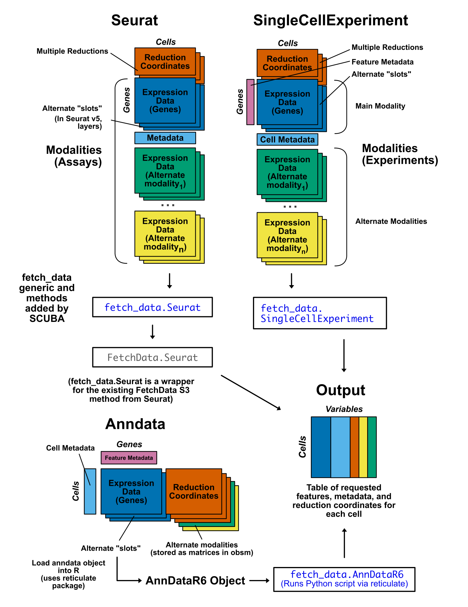

# SCUBA

## Overview

SCUBA (*S*ingle *C*ell *U*nified *B*ack end *A*PI) is a unified data accession interface for single-cell object classes. The package streamlines R data analysis for Seurat, SingleCellExperiment, and anndata objects by providing a consistent interface for data access, exploration, and visualization.

SCUBA can be used to retrieve the following information: 

- Feature expression data (genes, surface proteins, signatures, or any single-cell modality that can be expressed as a counts matrix)
- Cell metadata
- Reduction coordinates

The main function of SCUBA is `fetch_data()`. The workflow for `fetch_data()` is based on [Seurat's](https://satijalab.org/seurat/) `SeuratObject::FetchData()`. We added S3 methods to replicate the `FetchData` workflow in SingleCellExperiment and anndata objects.

`fetch_data()` returns data as an R data.frame with cells as rows, and variables requested as columns. The format of the output data.frame is consistent across all three object classes, allowing for the development of downstream visualization scripts that function the same for all accepted object classes. 



### Supported Single-Cell Objects

SCUBA currently supports the following object classes:

- [Seurat](https://satijalab.org/seurat/)
- [SingleCellExperiment](https://bioconductor.org/packages/release/bioc/html/SingleCellExperiment.html)
- [anndata](https://anndata.readthedocs.io/en/stable/)

Support for mudata objects will be added in the near future.

### Backwards Compatability with Seurat v4

Seurat v4 objects are compatible with SCUBA. `fetch_data()` is a wrapper for `SeuratObject::FetchData()` when used with Seurat objects, so the function supports all versions of Seurat objects that Seurat currently supports. If you are using an object created with Seurat v4, the `slot` parameter should be used instead of `layer` in the event you are accessing data from the `counts` or the `scale.data` layers (if you are accessing data from the `data` layer, this parameter is not needed, as is the case with Seurat).

### Spatial Single-Cell Modalities

SCUBA offers partial support for spatial single-cell modalities. Spatial data that is expressed as a counts matrix and stored in an assay/experiment/modality is supported by SCUBA, but spatial images are not currently supported. We will add support for spatial omics modalities in a future release.

## Installation

Run the command below to install SCUBA. BiocManager is used to automatically install Bioconductor dependencies (SCUBA is not a Bioconductor package).

If you plan to use SCUBA with anndata objects, use `dependencies = TRUE`. If you only plan to use SCUBA with Seurat and SingleCellExperiment objects, use `dependencies = FALSE`.

```r
if (!require("BiocManager", quietly = TRUE))
    install.packages("BiocManager")

# Set dependencies to FALSE if you do not plan to use anndata objects
BiocManager::install("amc-heme/SCUBA", dependencies = TRUE)
```

## Additional Installation for anndata Objects

To use SCUBA with anndata objects, you will need a Python installation and the reticulate R package. If you are using anndata objects, follow the steps below. **If you are only using Seurat of SingleCellExperiment objects, you do not need to complete these steps.**

First, install the [reticulate](https://rstudio.github.io/reticulate/) package in R.

```r
install.packages("reticulate")
```

Next, you will need to set up a version of Python with the necessary packages installed. There are several ways to do this. We recommend the use of an Anaconda environment, which will allow you to create an environment just for use by SCUBA that does not interfere with any other installations of Python you may have. The instructions below cover setting up an environment via anaconda, but other means of setting up Python environments will work with SCUBA. All that is needed is a Python environment connected to reticulate with the dependencies below installed:

- [anndata](https://anndata.readthedocs.io/en/stable/)
- [scipy](https://scipy.org/)
- [numpy](https://numpy.org/)
- [pandas](https://pandas.pydata.org/)

### Setting up a Python Environment via Anaconda

To set up an Anaconda environment with the requisite packages for SCUBA, follow the steps below:

1. Download an [Anaconda Distribution](https://www.anaconda.com/download). Use whichever installer is most appropriate for your operating system and preferences.

2. For MacOS and linux users: open a terminal window. For Windows users, you can open the Anaconda command prompt application (cmd.exe). Subsequent steps are the same for all operating systems. 

3. In the termainal, create a new conda environment for use with SCUBA. 

```bash
conda create --name SCUBA_anndata 
```

4. Next, "Activate" the environment to switch to it in the terminal.

```bash
conda activate SCUBA_anndata
```

You should now see "(SCUBA_anndata)" to the left side of your cursor in the terminal.

5. Next, install the [anndata](https://anndata.readthedocs.io/en/stable/) package according to the instructions from their website. Make sure to specify the channel with `-c` to install the most recent version.

```bash
conda install anndata -c conda-forge
```

6. SCUBA requires the following additional packages: [scipy](https://scipy.org/), [numpy](https://numpy.org/), and [pandas](https://pandas.pydata.org/). These should have been installed as dependencies when installing anndata. To verify these packages are present, you can run `conda list` on the environment:

```bash
conda list -n SCUBA_anndata pandas
conda list -n SCUBA_anndata scipy
conda list -n SCUBA_anndata numpy
```

If the package is present, you will see information for the package.

```
#
# Name                    Version                   Build  Channel
pandas                    2.2.3           py313h668b085_3    conda-forge

```

If it is not present, the list of information returned will have no rows. In this case, you can install the package via `conda install`.

```
# Name                    Version                   Build  Channel
```

7. Connect reticulate to the conda environment. To do this, run the following in an R console:

```r
reticulate::use_condaenv("SCUBA_anndata")
```

Step 7 will need to be repeated each time you restart your R session. If you are using RStudio, you may set a default Python environment to use with reticulate to avoid having to repeat this step each time. To do this in RStudio, complete the following:

- Go to **"Tools"** > **"Global Options"**. 
- In the window that appears, select **"Python"**. 
- Select the **"Select"** button next to the Python interpreter displayed. 
- In the window that appears, select **"Conda Environments"**.
- Select the path of your Conda environment (the path containing "SCUBA_Anndata" in this case).

## Additional Infomration

Please see our [website](https://amc-heme.github.io/SCUBA/) for a user guide and more information.

## Citation

Showers, W.M., Desai, J., Engel, K.L., Smith, C., Jordan, C.T. and Gillen, A.E. (2024) SCUBA implements a storage format-agnostic API for single-cell data access in R. [10.12688/f1000research.154675.1](https://doi.org/10.12688/f1000research.154675.1).

## Problems

If any issues arise please file a Github issue on this repository. 

<!-- badges: start -->
  [](https://github.com/amc-heme/SCUBA/actions/workflows/R-CMD-check.yaml)
  <!-- badges: end -->
