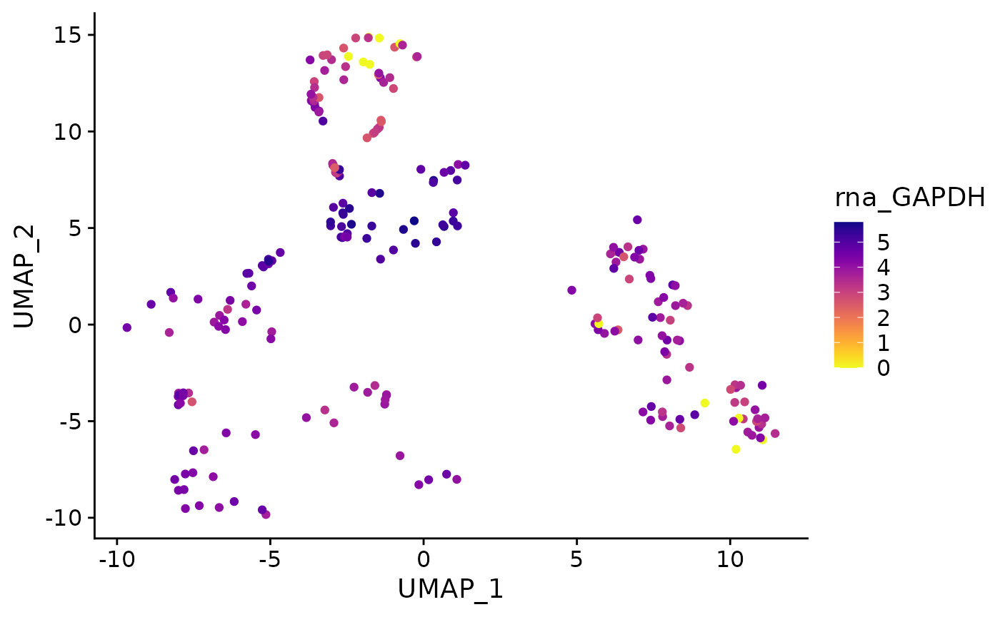
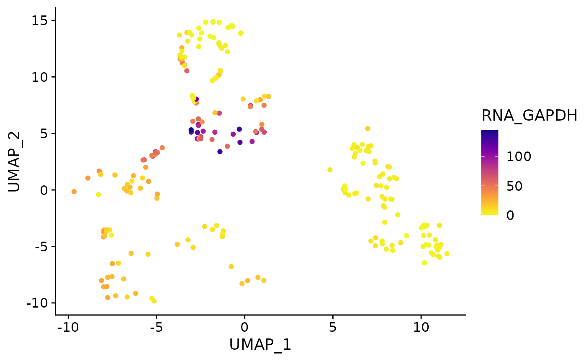
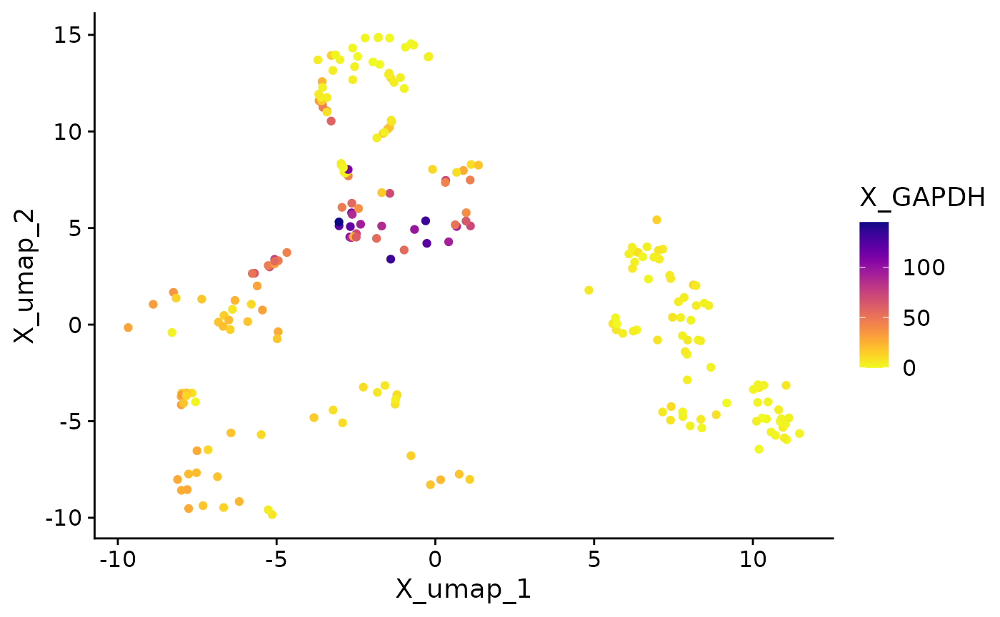

# User Guide

## Introduction

SCUBA provides several functions for exploration, access, and
visualization of data from single-cell objects. Each of these is covered
here, for each object type supported by SCUBA. SCUBA currently supports
Seurat, SingleCellExperiment, and anndata objects.

## Naming Conventions

Single-cell object classes use different terms to refer to the the same
or similar concepts. For simplicity, this tutorial will use one term for
each concept. The concepts mentioned in the tutorial are given below,
and for each concept, the terms used for each object class are
mentioned, along with the term that will be used for this tutorial.

- **Sequencing modalities**: the data structure used to store each type
  of single-cell data (i.e. scRNA-seq, surface protein measurements,
  ATAC-seq, etc.) is referred to as an “assay” in Seurat, an
  “experiment” in SingleCellExperiment, and a “modality” in anndata.
  This tutorial will use *“modality”*.
- **Data structure for transformed data**: in Seurat objects, the
  structure used for storing raw counts, normalized counts, and other
  transformations is known as a “slot”. In SingleCellExperiment, this is
  referred to as an “assay”, and in anndata, a “layer”. This tutorial
  will use *“layer”*.

## Setup

Please ensure you have loaded the SCUBA package before continuing. See
[here](https://amc-heme.github.io/SCUBA/index.html#installation) for
instructions to install SCUBA.

``` r
# Load package
library(SCUBA)
```

Next, load your single-cell object. Objects should be loaded according
using the conventional means for each object, shown below.

In this tutorial, we use `AML_Seurat`,
[`AML_SCE()`](https://amc-heme.github.io/SCUBA/reference/AML_SCE.md),
and
[`AML_h5ad()`](https://amc-heme.github.io/SCUBA/reference/anndata_example.md)
to load an example dataset included with SCUBA in Seurat,
SingleCellExperiment, and anndata format, respectively.

For anndata objects, we recommend loading via the
[`anndata`](https://github.com/dynverse/anndata) R package. This is
**not** the same as the anndata Python package that also must be
installed in a Python environment. For more information, see
[here](https://amc-heme.github.io/SCUBA/index.html#pre-requisites).

#### 

- Seurat
- SingleCellExperiment
- anndata

``` r
readRDS(
  # Replace with path to Seurat object
  "path/to/Seurat_object.rds"
  )
```

``` r
# Standard SingleCellExperiment objects
readRDS(
  # Replace with the path to your object
  "path/to/sce_object.rds"
)

# HDF5-storage enabled SingleCellExperiment objects saved via the HDF5Array package
HDF5Array::loadHDF5SummarizedExperiment(
  # Replace with the path to the directory created via
  # HDF5Array::saveHDF5SummarizedExperiment
  dir = "path/to/sce_dir/"
)
```

``` r
anndata::read_h5ad(
  "path_to_anndata_object.h5ad"
)
```

## Data Access

The primary data access method in SCUBA is
[`fetch_data()`](https://amc-heme.github.io/SCUBA/reference/fetch_data.md).
This function replicates the behavior of `FetchData()` in the
`SeuratObject` package. This function is an S3 generic that executes
methods based on the object type. When a Seurat object is passed to
[`fetch_data()`](https://amc-heme.github.io/SCUBA/reference/fetch_data.md),
the `FetchData` method from the `SeuratObject` package is ran. When
SingleCellExperiment or anndata objects are passed, methods from SCUBA
are dispatched that replicate the behavior of `FetchData` in these
objects.

[`fetch_data()`](https://amc-heme.github.io/SCUBA/reference/fetch_data.md)
can be used to fetch either feature expression data, metadata, or
reduction coordinates, all of which are fetched using the same
parameter, `vars`. For each entry passed to `vars`,
[`fetch_data()`](https://amc-heme.github.io/SCUBA/reference/fetch_data.md)
will automatically identify the type of data matching the input and
retrieve the data accordingly.

### Fetching Expression Data

[`fetch_data()`](https://amc-heme.github.io/SCUBA/reference/fetch_data.md)
can retrieve feature expression data from any assay in the object (or
“experiment” in SingleCellExperiment and “modality” in anndata objects).
To retrieve feature expression data, you can pass any number of features
to the `vars` parameter.

Features may have the same name across different
assays/experiments/modalities. For example, there may be data for both
CD4 gene and surface protein expression, or there may be both gene
expression and chromatin accessibility data for the same gene. To ensure
feature data from the correct modality is returned,
[`fetch_data()`](https://amc-heme.github.io/SCUBA/reference/fetch_data.md)
implements a syntax where a “key” is specified before the feature name,
with an underscore separating the key and the feature name.

    {"key" of the modality} + "_" + {feature name}

To determine the key to enter for the desired modality, we provide the
[`all_keys()`](https://amc-heme.github.io/SCUBA/reference/all_keys.md)
utility function. The output is a named character vector, with names
equal to the name of the modality, and values equal to the key to use.

#### 

- Seurat
- SingleCellExperiment
- anndata

``` r
all_keys(AML_Seurat)
```

    ## meta.data       RNA        AB       pca      umap 
    ##     "md_"    "rna_"     "ab_"     "PC_"   "UMAP_"

In this example object, use the “rna” key to pull data from the “RNA”
assay.

To pull gene expression data for FLT3, for example, you would pass
“rna_FLT3” to `vars`.

``` r
fetch_data(
  AML_Seurat,
  vars = "rna_FLT3"
  ) |>
  # First 10 rows are shown for this example
  head(10)
```

    ##          rna_FLT3
    ## 487013_1 0.000000
    ## 39207_1  0.000000
    ## 861619_1 0.000000
    ## 561110_1 0.000000
    ## 283967_1 0.000000
    ## 422573_1 0.000000
    ## 453256_1 1.620299
    ## 531766_1 0.000000
    ## 796968_1 0.000000
    ## 624345_1 2.037607

``` r
all_keys(AML_SCE())
```

    ##    RNA     AB    PCA   UMAP 
    ##  "RNA"   "AB"  "PCA" "UMAP"

In this example object, use the “RNA” key to pull data from the “RNA”
assay.

To pull gene expression data for FLT3, for example, you would pass
“RNA_FLT3” to `vars`.

``` r
fetch_data(
  AML_SCE(),
  vars = "RNA_FLT3"
  ) |>
  # First 10 rows are shown for this example
  head(10)
```

    ##          RNA_FLT3
    ## 487013_1 0.000000
    ## 39207_1  0.000000
    ## 861619_1 0.000000
    ## 561110_1 0.000000
    ## 283967_1 0.000000
    ## 422573_1 0.000000
    ## 453256_1 1.620299
    ## 531766_1 0.000000
    ## 796968_1 0.000000
    ## 624345_1 2.037607

``` r
all_keys(AML_h5ad())
```

    ##         X     X_pca    X_umap   protein 
    ##       "X"   "X_pca"  "X_umap" "protein"

By convention, the gene expression modality in anndata objects is named
“X”. In this example object, use the “X” key to pull data from the “RNA”
assay.

To pull gene expression data for FLT3, for example, you would pass
“X_FLT3” to `vars`.

``` r
fetch_data(
  AML_h5ad(),
  vars = "X_FLT3"
  ) |>
  # First 10 rows are shown for this example
  head(10)
```

    ##            X_FLT3
    ## 487013_1 0.000000
    ## 39207_1  0.000000
    ## 861619_1 0.000000
    ## 561110_1 0.000000
    ## 283967_1 0.000000
    ## 422573_1 0.000000
    ## 453256_1 1.620299
    ## 531766_1 0.000000
    ## 796968_1 0.000000
    ## 624345_1 2.037607

#### 

Any number of features can be passed to vars as a character vector. To
view available features for a modality, SCUBA provides the
[`features_in_assay()`](https://amc-heme.github.io/SCUBA/reference/features_in_assay.md)
generic. Use the `assay` parameter to specify the modality, using the
name instead of the key. This utility generic can be used to query
available features in a modality, and check if a feature is represented
in the data for the assay before passage to fetch_data.

- Seurat
- SingleCellExperiment
- anndata

``` r
available_genes <-
  features_in_assay(
    AML_Seurat,
    # For this object, "RNA" is the gene expression assay
    assay = "RNA"
  )

available_genes |> 
  head(10)
```

    ##  [1] "ACTG1"   "ADGRG1"  "AHSP"    "AIF1"    "ANK1"    "ANKRD28" "ANLN"   
    ##  [8] "ANP32E"  "ANPEP"   "ANXA2"

``` r
# Test if a gene is present in the RNA assay before passage to fetch_data
"MEIS1" %in% available_genes
```

    ## [1] TRUE

``` r
# Request data for multiple features
fetch_data(
  AML_Seurat,
  vars = c("rna_FLT3", "rna_MEIS1")
  ) |>
  head(10)
```

    ##          rna_FLT3 rna_MEIS1
    ## 487013_1 0.000000         0
    ## 39207_1  0.000000         0
    ## 861619_1 0.000000         0
    ## 561110_1 0.000000         0
    ## 283967_1 0.000000         0
    ## 422573_1 0.000000         0
    ## 453256_1 1.620299         0
    ## 531766_1 0.000000         0
    ## 796968_1 0.000000         0
    ## 624345_1 2.037607         0

``` r
available_genes <-
  features_in_assay(
    AML_SCE(),
    # In this object, RNA is the name of the gene expression experiment
    assay = "RNA"
  )

available_genes |> 
  head(10)
```

    ##  [1] "ACTG1"   "ADGRG1"  "AHSP"    "AIF1"    "ANK1"    "ANKRD28" "ANLN"   
    ##  [8] "ANP32E"  "ANPEP"   "ANXA2"

``` r
# Test if a gene is present in the RNA assay before passage to fetch_data
"MEIS1" %in% available_genes
```

    ## [1] TRUE

``` r
# Request data for multiple features
fetch_data(
  AML_SCE(),
  vars = c("RNA_FLT3", "RNA_MEIS1")
  ) |>
  head(10)
```

    ##          RNA_FLT3 RNA_MEIS1
    ## 487013_1 0.000000         0
    ## 39207_1  0.000000         0
    ## 861619_1 0.000000         0
    ## 561110_1 0.000000         0
    ## 283967_1 0.000000         0
    ## 422573_1 0.000000         0
    ## 453256_1 1.620299         0
    ## 531766_1 0.000000         0
    ## 796968_1 0.000000         0
    ## 624345_1 2.037607         0

``` r
available_genes <-
  features_in_assay(
    AML_h5ad(),
    assay = "X"
  )

available_genes |> 
  head(10)
```

    ##  [1] "ACTG1"   "ADGRG1"  "AHSP"    "AIF1"    "ANK1"    "ANKRD28" "ANLN"   
    ##  [8] "ANP32E"  "ANPEP"   "ANXA2"

``` r
# Test if a gene is present in the RNA assay before passage to fetch_data
"MEIS1" %in% available_genes
```

    ## [1] TRUE

``` r
# Request data for multiple features
fetch_data(
  AML_h5ad(),
  vars = c("X_FLT3", "X_MEIS1")
  ) |>
  head(10)
```

    ##            X_FLT3 X_MEIS1
    ## 487013_1 0.000000       0
    ## 39207_1  0.000000       0
    ## 861619_1 0.000000       0
    ## 561110_1 0.000000       0
    ## 283967_1 0.000000       0
    ## 422573_1 0.000000       0
    ## 453256_1 1.620299       0
    ## 531766_1 0.000000       0
    ## 796968_1 0.000000       0
    ## 624345_1 2.037607       0

#### 

### Expression Data from Alternate Layers

By default,
[`fetch_data()`](https://amc-heme.github.io/SCUBA/reference/fetch_data.md)
will pull data from the normalized counts layer. In Seurat objects, this
is the “Data” layer and in SingleCellExperiment objects, this is
“logcounts”. In anndata objects, it is customary to store normalized
count data in the X matrix. (If normalized counts data in your object is
stored elsewhere, see the “anndata” tab below).

To pull data from alternate layers, use the `layer` parameter.

#### 

- Seurat
- SingleCellExperiment
- anndata

Below, feature expression data is pulled from raw counts (the `counts`
slot).

``` r
fetch_data(
  AML_Seurat,
  vars = c("rna_FLT3", "rna_MEIS1"),
  slot = "counts"
  ) |>
  head(10)
```

    ## Warning: The `slot` argument of `FetchData()` is deprecated as of SeuratObject 5.0.0.
    ## ℹ Please use the `layer` argument instead.
    ## ℹ The deprecated feature was likely used in the SCUBA package.
    ##   Please report the issue to the authors.
    ## This warning is displayed once every 8 hours.
    ## Call `lifecycle::last_lifecycle_warnings()` to see where this warning was
    ## generated.

    ##          rna_FLT3 rna_MEIS1
    ## 487013_1        0         0
    ## 39207_1         0         0
    ## 861619_1        0         0
    ## 561110_1        0         0
    ## 283967_1        0         0
    ## 422573_1        0         0
    ## 453256_1        3         0
    ## 531766_1        0         0
    ## 796968_1        0         0
    ## 624345_1        4         0

#### Note

In Seurat v4 and earlier, the `layer` parameter was named `slot`. If you
are using Seurat v4 or earlier, you will need to use `slot` instead of
`layer`. This difference does not affect SingleCellExperiment or anndata
objects: for these objects, only `layer` should be used.

Below, feature expression data is pulled from raw counts (the `counts`
layer, referred to as the `counts` “assay” in SingleCellExperiment).

``` r
fetch_data(
  AML_SCE(),
  vars = c("RNA_FLT3", "RNA_MEIS1"),
  layer = "counts"
  ) |>
  head(10)
```

    ##          RNA_FLT3 RNA_MEIS1
    ## 487013_1        0         0
    ## 39207_1         0         0
    ## 861619_1        0         0
    ## 561110_1        0         0
    ## 283967_1        0         0
    ## 422573_1        0         0
    ## 453256_1        3         0
    ## 531766_1        0         0
    ## 796968_1        0         0
    ## 624345_1        4         0

If the layer parameter is undefined for anndata objects,
[`fetch_data()`](https://amc-heme.github.io/SCUBA/reference/fetch_data.md)
will use whichever matrix is present in X. If normalized counts data is
stored in an alternate layer in the `layers` slot, the name of that
layer must be passed to `layers` to retrieve the normalized counts
matrix.

In the example object below, normalized counts are stored in X, and raw
counts are stored in an alternate layer named “counts”.

``` r
# Raw counts in "counts"
fetch_data(
  AML_h5ad(),
  vars = c("X_FLT3", "X_MEIS1"),
  layer = "counts"
  ) |>
  head(10)
```

    ##          X_FLT3 X_MEIS1
    ## 487013_1      0       0
    ## 39207_1       0       0
    ## 861619_1      0       0
    ## 561110_1      0       0
    ## 283967_1      0       0
    ## 422573_1      0       0
    ## 453256_1      3       0
    ## 531766_1      0       0
    ## 796968_1      0       0
    ## 624345_1      4       0

``` r
# Normalized counts in X
fetch_data(
  AML_h5ad(),
  vars = c("X_FLT3", "X_MEIS1")
  ) |>
  head(10)
```

    ##            X_FLT3 X_MEIS1
    ## 487013_1 0.000000       0
    ## 39207_1  0.000000       0
    ## 861619_1 0.000000       0
    ## 561110_1 0.000000       0
    ## 283967_1 0.000000       0
    ## 422573_1 0.000000       0
    ## 453256_1 1.620299       0
    ## 531766_1 0.000000       0
    ## 796968_1 0.000000       0
    ## 624345_1 2.037607       0

### Fetching Metadata

To retrieve metadata, pass the name of the metadata variable to fetch to
the `vars` parameter of
[`fetch_data()`](https://amc-heme.github.io/SCUBA/reference/fetch_data.md).
You can pass any number of metadata variables to `vars` as a character
vector. Any metadata variable in the object can be retrieved, and there
are no differences in input between categorical and numeric metadata
variables.

To view available metadata variables in an object, SCUBA provides the
[`meta_varnames()`](https://amc-heme.github.io/SCUBA/reference/meta_varnames.md)
utility function.

#### 

- Seurat
- SingleCellExperiment
- anndata

``` r
# View available metadata
meta_varnames(AML_Seurat)
```

    ##  [1] "orig.ident"          "nCount_RNA"          "nFeature_RNA"       
    ##  [4] "nCount_AB"           "nFeature_AB"         "nCount_BOTH"        
    ##  [7] "nFeature_BOTH"       "BOTH_snn_res.0.9"    "seurat_clusters"    
    ## [10] "Prediction_Ind"      "BOTH_snn_res.1"      "ClusterID"          
    ## [13] "Batch"               "x"                   "y"                  
    ## [16] "x_mean"              "y_mean"              "cor"                
    ## [19] "ct"                  "prop"                "meandist"           
    ## [22] "cDC"                 "B.cells"             "Myelocytes"         
    ## [25] "Erythroid"           "Megakaryocte"        "Ident"              
    ## [28] "RNA_snn_res.0.4"     "condensed_cell_type"

``` r
fetch_data(
  AML_Seurat,
  vars = c("condensed_cell_type", "Batch", "nCount_RNA")
  ) |>
  # head is used in this example since metadata will be returned for all cells
  head(10)
```

    ##                   condensed_cell_type    Batch nCount_RNA
    ## 487013_1                 Plasma cells BM_200AB      10863
    ## 39207_1                  Plasma cells BM_200AB       8403
    ## 861619_1                 Plasma cells BM_200AB       8100
    ## 561110_1                 Plasma cells BM_200AB       8151
    ## 283967_1                    Primitive BM_200AB       8828
    ## 422573_1                 Plasma cells BM_200AB       5188
    ## 453256_1              Dendritic cells BM_200AB       7399
    ## 531766_1                    Primitive BM_200AB       6621
    ## 796968_1                    Primitive BM_200AB       6243
    ## 624345_1 Plasmacytoid dendritic cells BM_200AB       5995

``` r
# View available metadata
meta_varnames(AML_SCE())
```

    ##  [1] "orig.ident"          "nCount_RNA"          "nFeature_RNA"       
    ##  [4] "nCount_AB"           "nFeature_AB"         "nCount_BOTH"        
    ##  [7] "nFeature_BOTH"       "BOTH_snn_res.0.9"    "seurat_clusters"    
    ## [10] "Prediction_Ind"      "BOTH_snn_res.1"      "ClusterID"          
    ## [13] "Batch"               "x"                   "y"                  
    ## [16] "x_mean"              "y_mean"              "cor"                
    ## [19] "ct"                  "prop"                "meandist"           
    ## [22] "cDC"                 "B.cells"             "Myelocytes"         
    ## [25] "Erythroid"           "Megakaryocte"        "Ident"              
    ## [28] "RNA_snn_res.0.4"     "condensed_cell_type" "ident"

``` r
fetch_data(
  AML_SCE(),
  vars = c("condensed_cell_type", "Batch", "nCount_RNA")
  ) |>
  # head is used in this example since metadata will be returned for all cells
  head(10)
```

    ##                   condensed_cell_type    Batch nCount_RNA
    ## 487013_1                 Plasma cells BM_200AB      10863
    ## 39207_1                  Plasma cells BM_200AB       8403
    ## 861619_1                 Plasma cells BM_200AB       8100
    ## 561110_1                 Plasma cells BM_200AB       8151
    ## 283967_1                    Primitive BM_200AB       8828
    ## 422573_1                 Plasma cells BM_200AB       5188
    ## 453256_1              Dendritic cells BM_200AB       7399
    ## 531766_1                    Primitive BM_200AB       6621
    ## 796968_1                    Primitive BM_200AB       6243
    ## 624345_1 Plasmacytoid dendritic cells BM_200AB       5995

``` r
# View available metadata
meta_varnames(AML_h5ad())
```

    ##  [1] "nCount_RNA"          "nFeature_RNA"        "nCount_AB"          
    ##  [4] "nFeature_AB"         "nCount_BOTH"         "nFeature_BOTH"      
    ##  [7] "BOTH_snn_res.0.9"    "seurat_clusters"     "Prediction_Ind"     
    ## [10] "BOTH_snn_res.1"      "ClusterID"           "Batch"              
    ## [13] "x"                   "y"                   "x_mean"             
    ## [16] "y_mean"              "cor"                 "ct"                 
    ## [19] "prop"                "meandist"            "cDC"                
    ## [22] "B.cells"             "Myelocytes"          "Erythroid"          
    ## [25] "Megakaryocte"        "Ident"               "RNA_snn_res.0.4"    
    ## [28] "condensed_cell_type"

``` r
fetch_data(
  AML_h5ad(),
  vars = c("condensed_cell_type", "Batch", "nCount_RNA")
  ) |>
  # head is used in this example since metadata will be returned for all cells
  head(10)
```

    ##                   condensed_cell_type    Batch nCount_RNA
    ## 487013_1                 Plasma cells BM_200AB      10863
    ## 39207_1                  Plasma cells BM_200AB       8403
    ## 861619_1                 Plasma cells BM_200AB       8100
    ## 561110_1                 Plasma cells BM_200AB       8151
    ## 283967_1                    Primitive BM_200AB       8828
    ## 422573_1                 Plasma cells BM_200AB       5188
    ## 453256_1              Dendritic cells BM_200AB       7399
    ## 531766_1                    Primitive BM_200AB       6621
    ## 796968_1                    Primitive BM_200AB       6243
    ## 624345_1 Plasmacytoid dendritic cells BM_200AB       5995

#### 

#### `fetch_metadata` Generic

If you are retrieving just metadata from very large single-cell objects,
we offer a
[`fetch_metadata()`](https://amc-heme.github.io/SCUBA/reference/fetch_metadata.md)
method that is faster than using
[`fetch_data()`](https://amc-heme.github.io/SCUBA/reference/fetch_data.md).
As with
[`fetch_data()`](https://amc-heme.github.io/SCUBA/reference/fetch_data.md),
desired metadata variables are passed to `vars`.

#### Note

In anndata objects,
[`fetch_metadata()`](https://amc-heme.github.io/SCUBA/reference/fetch_metadata.md)
does not offer performance advantages over
[`fetch_data()`](https://amc-heme.github.io/SCUBA/reference/fetch_data.md).

#### 

- Seurat
- SingleCellExperiment
- anndata

``` r
fetch_metadata(
  AML_Seurat,
  vars = c("condensed_cell_type", "Batch", "nCount_RNA")
  ) |>
  # head is used in this example since metadata will be returned for all cells
  head(10)
```

    ##                   condensed_cell_type    Batch nCount_RNA
    ## 487013_1                 Plasma cells BM_200AB      10863
    ## 39207_1                  Plasma cells BM_200AB       8403
    ## 861619_1                 Plasma cells BM_200AB       8100
    ## 561110_1                 Plasma cells BM_200AB       8151
    ## 283967_1                    Primitive BM_200AB       8828
    ## 422573_1                 Plasma cells BM_200AB       5188
    ## 453256_1              Dendritic cells BM_200AB       7399
    ## 531766_1                    Primitive BM_200AB       6621
    ## 796968_1                    Primitive BM_200AB       6243
    ## 624345_1 Plasmacytoid dendritic cells BM_200AB       5995

``` r
fetch_metadata(
  AML_SCE(),
  vars = c("condensed_cell_type", "Batch", "nCount_RNA")
  ) |>
  # head is used in this example since metadata will be returned for all cells
  head(10)
```

    ##                   condensed_cell_type    Batch nCount_RNA
    ## 487013_1                 Plasma cells BM_200AB      10863
    ## 39207_1                  Plasma cells BM_200AB       8403
    ## 861619_1                 Plasma cells BM_200AB       8100
    ## 561110_1                 Plasma cells BM_200AB       8151
    ## 283967_1                    Primitive BM_200AB       8828
    ## 422573_1                 Plasma cells BM_200AB       5188
    ## 453256_1              Dendritic cells BM_200AB       7399
    ## 531766_1                    Primitive BM_200AB       6621
    ## 796968_1                    Primitive BM_200AB       6243
    ## 624345_1 Plasmacytoid dendritic cells BM_200AB       5995

``` r
fetch_metadata(
  AML_h5ad(),
  vars = c("condensed_cell_type", "Batch", "nCount_RNA")
  ) |>
  # head is used in this example since metadata will be returned for all cells
  head(10)
```

    ##                   condensed_cell_type    Batch nCount_RNA
    ## 487013_1                 Plasma cells BM_200AB      10863
    ## 39207_1                  Plasma cells BM_200AB       8403
    ## 861619_1                 Plasma cells BM_200AB       8100
    ## 561110_1                 Plasma cells BM_200AB       8151
    ## 283967_1                    Primitive BM_200AB       8828
    ## 422573_1                 Plasma cells BM_200AB       5188
    ## 453256_1              Dendritic cells BM_200AB       7399
    ## 531766_1                    Primitive BM_200AB       6621
    ## 796968_1                    Primitive BM_200AB       6243
    ## 624345_1 Plasmacytoid dendritic cells BM_200AB       5995

#### 

In a programming context, it may be useful to pull the full table. This
can be done with
[`fetch_metadata()`](https://amc-heme.github.io/SCUBA/reference/fetch_metadata.md)
using the `full_table` parameter.

#### 

- Seurat
- SingleCellExperiment
- anndata

``` r
table <- 
  fetch_metadata(
    AML_Seurat,
    full_table = TRUE
    )

table[1:10, 1:5]
```

    ##             orig.ident nCount_RNA nFeature_RNA nCount_AB nFeature_AB
    ## 487013_1 SeuratProject      10863          228     25709         195
    ## 39207_1  SeuratProject       8403          210     31367         195
    ## 861619_1 SeuratProject       8100          196     28166         195
    ## 561110_1 SeuratProject       8151          179     14440         194
    ## 283967_1 SeuratProject       8828          242      8203         191
    ## 422573_1 SeuratProject       5188          147      8634         192
    ## 453256_1 SeuratProject       7399          264     20649         194
    ## 531766_1 SeuratProject       6621          232     17549         192
    ## 796968_1 SeuratProject       6243          229     15178         193
    ## 624345_1 SeuratProject       5995          246     22268         194

``` r
table <-
  fetch_metadata(
    AML_SCE(),
    full_table = TRUE
    )

table[1:10, 1:5]
```

    ## DataFrame with 10 rows and 5 columns
    ##             orig.ident nCount_RNA nFeature_RNA nCount_AB nFeature_AB
    ##            <character>  <numeric>    <integer> <numeric>   <integer>
    ## 487013_1 SeuratProject      10863          228     25709         195
    ## 39207_1  SeuratProject       8403          210     31367         195
    ## 861619_1 SeuratProject       8100          196     28166         195
    ## 561110_1 SeuratProject       8151          179     14440         194
    ## 283967_1 SeuratProject       8828          242      8203         191
    ## 422573_1 SeuratProject       5188          147      8634         192
    ## 453256_1 SeuratProject       7399          264     20649         194
    ## 531766_1 SeuratProject       6621          232     17549         192
    ## 796968_1 SeuratProject       6243          229     15178         193
    ## 624345_1 SeuratProject       5995          246     22268         194

``` r
table <-
  fetch_metadata(
    AML_h5ad(),
    full_table = TRUE
    )

table[1:10, 1:5]
```

    ##          nCount_RNA nFeature_RNA nCount_AB nFeature_AB nCount_BOTH
    ## 487013_1      10863          228     25709         195       36572
    ## 39207_1        8403          210     31367         195       39770
    ## 861619_1       8100          196     28166         195       36266
    ## 561110_1       8151          179     14440         194       22591
    ## 283967_1       8828          242      8203         191       17031
    ## 422573_1       5188          147      8634         192       13822
    ## 453256_1       7399          264     20649         194       28048
    ## 531766_1       6621          232     17549         192       24170
    ## 796968_1       6243          229     15178         193       21421
    ## 624345_1       5995          246     22268         194       28263

### Fetching Reduction Coordinates

In a similar manner to expression data, reduction coordinates to fetch
are passed to `vars` using a “key” and underscore system. In this case,
you would enter the key of the reduction to use, and an integer
specifying the dimension of the reduction to pull from.

    {"key" of the reduction} + "_" + {dimension}

As with assays/modalities, run
[`all_keys()`](https://amc-heme.github.io/SCUBA/reference/all_keys.md)
to see the key corresponding to the reduction you would like to pull
data from. Examples for each object type are provided below.

#### 

- Seurat
- SingleCellExperiment
- anndata

From running
[`all_keys()`](https://amc-heme.github.io/SCUBA/reference/all_keys.md),
the key of the UMAP reduction in this object is “UMAP\_”.

``` r
all_keys(AML_Seurat)
```

    ## meta.data       RNA        AB       pca      umap 
    ##     "md_"    "rna_"     "ab_"     "PC_"   "UMAP_"

To fetch the first and second dims, pass “UMAP_1” and “UMAP_2” to
`vars`.

``` r
fetch_data(
  AML_Seurat,
  vars = c("UMAP_1", "UMAP_2")
  ) |>
  head(10)
```

    ##             UMAP_1    UMAP_2
    ## 487013_1 -1.643589  9.901035
    ## 39207_1  -1.504856 10.125558
    ## 861619_1 -1.448029 10.210141
    ## 561110_1 -1.375756 10.512531
    ## 283967_1 -1.405495  3.389042
    ## 422573_1 -1.391848 10.582989
    ## 453256_1 -2.676966  5.075310
    ## 531766_1 -3.032746  5.115050
    ## 796968_1 -3.034830  5.314629
    ## 624345_1 -2.692851  4.533458

From running
[`all_keys()`](https://amc-heme.github.io/SCUBA/reference/all_keys.md),
the key of the UMAP reduction in this object is “UMAP\_”.

``` r
all_keys(AML_SCE())
```

    ##    RNA     AB    PCA   UMAP 
    ##  "RNA"   "AB"  "PCA" "UMAP"

To fetch the first and second dims, pass “UMAP_1” and “UMAP_2” to
`vars`.

``` r
fetch_data(
  AML_SCE(),
  vars = c("UMAP_1", "UMAP_2")
  ) |>
  head(10)
```

    ##             UMAP_1    UMAP_2
    ## 487013_1 -1.643589  9.901035
    ## 39207_1  -1.504856 10.125558
    ## 861619_1 -1.448029 10.210141
    ## 561110_1 -1.375756 10.512531
    ## 283967_1 -1.405495  3.389042
    ## 422573_1 -1.391848 10.582989
    ## 453256_1 -2.676966  5.075310
    ## 531766_1 -3.032746  5.115050
    ## 796968_1 -3.034830  5.314629
    ## 624345_1 -2.692851  4.533458

From running
[`all_keys()`](https://amc-heme.github.io/SCUBA/reference/all_keys.md),
the key of the UMAP reduction in this object is “X_umap\_”.

``` r
all_keys(AML_h5ad())
```

    ##         X     X_pca    X_umap   protein 
    ##       "X"   "X_pca"  "X_umap" "protein"

To fetch the first and second dims, pass “X_umap_1” and “X_umap_2” to
`vars`.

``` r
fetch_data(
  AML_h5ad(),
  vars = c("X_umap_1", "X_umap_2")
  ) |>
  head(10)
```

    ##           X_umap_1  X_umap_2
    ## 487013_1 -1.643589  9.901035
    ## 39207_1  -1.504856 10.125558
    ## 861619_1 -1.448029 10.210141
    ## 561110_1 -1.375756 10.512531
    ## 283967_1 -1.405495  3.389042
    ## 422573_1 -1.391848 10.582989
    ## 453256_1 -2.676966  5.075310
    ## 531766_1 -3.032746  5.115050
    ## 796968_1 -3.034830  5.314629
    ## 624345_1 -2.692851  4.533458

#### 

  

#### `fetch_reduction` Generic

As with metadata, we provide a separate generic,
[`fetch_reduction()`](https://amc-heme.github.io/SCUBA/reference/fetch_reduction.md),
that is faster than using
[`fetch_data()`](https://amc-heme.github.io/SCUBA/reference/fetch_data.md)
when retrieving just reduction coordinates from very large single-cell
objects. Performance gains are observed in Seurat and
SingleCellExperiment objects, but not in anndata objects (performance is
the same as
[`fetch_data()`](https://amc-heme.github.io/SCUBA/reference/fetch_data.md)
for this object class).

The syntax for pulling reduction coordinates varies slightly from
[`fetch_data()`](https://amc-heme.github.io/SCUBA/reference/fetch_data.md).
Instead of entering the reduction name and the dimensions together an
underscore, this information is supplied to separate parameters.

The key of reduction to pull data from is passed to `reduction`, and the
dimensions from which to pull coordinates are passed in numeric format
to `dims`. Any number of dimensions can be passed, but in most cases,
two dimensions are pulled. If `dims` is not specified, the first and
second dimensions of the specified reduction are returned.

#### 

- Seurat
- SingleCellExperiment
- anndata

``` r
fetch_reduction(
  AML_Seurat,
  reduction = "umap",
  dims = c(1, 2)
  ) |>
  # head is used in this example since metadata will be returned for all cells
  head(10)
```

    ##             UMAP_1    UMAP_2
    ## 487013_1 -1.643589  9.901035
    ## 39207_1  -1.504856 10.125558
    ## 861619_1 -1.448029 10.210141
    ## 561110_1 -1.375756 10.512531
    ## 283967_1 -1.405495  3.389042
    ## 422573_1 -1.391848 10.582989
    ## 453256_1 -2.676966  5.075310
    ## 531766_1 -3.032746  5.115050
    ## 796968_1 -3.034830  5.314629
    ## 624345_1 -2.692851  4.533458

``` r
fetch_reduction(
  AML_SCE(),
  reduction = "UMAP",
  dims = c(1, 2)
  ) |>
  # head is used in this example since metadata will be returned for all cells
  head(10)
```

    ##             UMAP_1    UMAP_2
    ## 487013_1 -1.643589  9.901035
    ## 39207_1  -1.504856 10.125558
    ## 861619_1 -1.448029 10.210141
    ## 561110_1 -1.375756 10.512531
    ## 283967_1 -1.405495  3.389042
    ## 422573_1 -1.391848 10.582989
    ## 453256_1 -2.676966  5.075310
    ## 531766_1 -3.032746  5.115050
    ## 796968_1 -3.034830  5.314629
    ## 624345_1 -2.692851  4.533458

``` r
fetch_reduction(
  AML_h5ad(),
  reduction = "X_umap",
  dims = c(1, 2)
  ) |>
  # head is used in this example since metadata will be returned for all cells
  head(10)
```

    ##           X_umap_1  X_umap_2
    ## 487013_1 -1.643589  9.901035
    ## 39207_1  -1.504856 10.125558
    ## 861619_1 -1.448029 10.210141
    ## 561110_1 -1.375756 10.512531
    ## 283967_1 -1.405495  3.389042
    ## 422573_1 -1.391848 10.582989
    ## 453256_1 -2.676966  5.075310
    ## 531766_1 -3.032746  5.115050
    ## 796968_1 -3.034830  5.314629
    ## 624345_1 -2.692851  4.533458

### Fetch Data from a Subset of Cells

In some circumstances, you may wish to access data from a subset of
cells, rather than the full object.
[`fetch_data()`](https://amc-heme.github.io/SCUBA/reference/fetch_data.md),
[`fetch_metadata()`](https://amc-heme.github.io/SCUBA/reference/fetch_metadata.md),
and
[`fetch_reduction()`](https://amc-heme.github.io/SCUBA/reference/fetch_reduction.md)
provide a `cells` parameter to do this.

The `cells` parameter accepts a character vector with the cell IDs for
which to return data. We provide a utility function,
[`fetch_cells()`](https://amc-heme.github.io/SCUBA/reference/fetch_cells.md),
to generate this.

[`fetch_cells()`](https://amc-heme.github.io/SCUBA/reference/fetch_cells.md)
accepts a categorical metadata variable and a vector of values/levels to
filter by. Cells with values matching the values entered will be
returned.

To view available values for a metadata variable, you can use the
[`unique_values()`](https://amc-heme.github.io/SCUBA/reference/unique_values.md)
function.

#### 

- Seurat
- SingleCellExperiment
- anndata

Identifying available values for the variable “Batch”:

``` r
unique_values(AML_Seurat, var = "Batch")
```

    ## [1] "BM_200AB"   "PBMC_200AB"

Returning cells are returned where “Batch” is equal to “PBMC_200AB”:

``` r
cell_subset <- 
  fetch_cells(
    object = AML_Seurat, 
    meta_var = "Batch", 
    meta_levels = "PBMC_200AB"
    )

# Preview cell IDs returned
cell_subset[1:6]
```

    ## [1] "844178_2" "809777_2" "613075_2" "401992_2" "15150_2"  "208437_2"

``` r
# Number of cells
length(cell_subset)
```

    ## [1] 98

Retrieving expression data for the subset:

``` r
data <-
  fetch_data(
    AML_Seurat,
    vars = "rna_FLT3",
    cells = cell_subset
    )

str(data)
```

    ## 'data.frame':    98 obs. of  1 variable:
    ##  $ rna_FLT3: num  0 0 0 0 0 0 0 0 0 0 ...

``` r
# Compare with full data
full_data <-
  fetch_data(
    AML_Seurat,
    vars = "rna_FLT3"
    )

str(full_data)
```

    ## 'data.frame':    250 obs. of  1 variable:
    ##  $ rna_FLT3: num  0 0 0 0 0 ...

Identifying available values for the variable “Batch”:

``` r
unique_values(AML_SCE(), var = "Batch")
```

    ## [1] "BM_200AB"   "PBMC_200AB"

Returning cells are returned where “Batch” is equal to “PBMC_200AB”:

``` r
cell_subset <- 
  fetch_cells(
    object = AML_SCE(), 
    meta_var = "Batch", 
    meta_levels = "PBMC_200AB"
    )

# Preview cell IDs returned
cell_subset[1:6]
```

    ## [1] "844178_2" "809777_2" "613075_2" "401992_2" "15150_2"  "208437_2"

``` r
# Number of cells
length(cell_subset)
```

    ## [1] 98

Retrieving expression data for the subset:

``` r
data <-
  fetch_data(
    AML_SCE(),
    vars = "RNA_FLT3",
    cells = cell_subset
    )

str(data)
```

    ## 'data.frame':    98 obs. of  1 variable:
    ##  $ RNA_FLT3: num  0 0 0 0 0 0 0 0 0 0 ...

``` r
# Compare with full data
full_data <-
  fetch_data(
    AML_SCE(),
    vars = "RNA_FLT3"
    )

str(full_data)
```

    ## 'data.frame':    250 obs. of  1 variable:
    ##  $ RNA_FLT3: num  0 0 0 0 0 ...

Identifying available values for the variable “Batch”:

``` r
unique_values(AML_h5ad(), var = "Batch")
```

    ## [1] BM_200AB   PBMC_200AB
    ## Levels: BM_200AB PBMC_200AB

Returning cells are returned where “Batch” is equal to “PBMC_200AB”:

``` r
cell_subset <- 
  fetch_cells(
    object = AML_h5ad(), 
    meta_var = "Batch", 
    meta_levels = "PBMC_200AB"
    )

# Preview cell IDs returned
cell_subset[1:6]
```

    ## [1] "844178_2" "809777_2" "613075_2" "401992_2" "15150_2"  "208437_2"

``` r
# Number of cells
length(cell_subset)
```

    ## [1] 98

Retrieving expression data for the subset:

``` r
data <-
  fetch_data(
    AML_h5ad(),
    vars = "X_FLT3",
    cells = cell_subset
    )

str(data)
```

    ## 'data.frame':    98 obs. of  1 variable:
    ##  $ X_FLT3: num  0 0 0 0 0 0 0 0 0 0 ...
    ##  - attr(*, "pandas.index")=Index(['844178_2', '809777_2', '613075_2', '401992_2', '15150_2', '208437_2',
    ##        '368193_2', '457499_2', '29093_2', '744754_2', '800098_2', '754060_2',
    ##        '632183_2', '759680_2', '694449_2', '700832_2', '1257_2', '448980_2',
    ##        '199181_2', '833067_2', '251571_2', '736115_2', '712624_2', '707144_2',
    ##        '859209_2', '253883_2', '653923_2', '762295_2', '320896_2', '99676_2',
    ##        '800149_2', '682908_2', '780178_2', '852293_2', '615431_2', '218771_2',
    ##        '116904_2', '290694_2', '611301_2', '147803_2', '576873_2', '884381_2',
    ##        '127725_2', '502119_2', '607265_2', '680163_2', '787312_2', '60207_2',
    ##        '326911_2', '632894_2', '683104_2', '765082_2', '628813_2', '668067_2',
    ##        '242368_2', '157340_2', '351199_2', '409871_2', '511910_2', '488361_2',
    ##        '467352_2', '376467_2', '749121_2', '50361_2', '155312_2', '785055_2',
    ##        '246318_2', '665215_2', '634705_2', '610060_2', '89949_2', '874939_2',
    ##        '624530_2', '721485_2', '48168_2', '257195_2', '391063_2', '655228_2',
    ##        '752608_2', '687706_2', '382710_2', '700441_2', '38920_2', '564255_2',
    ##        '125842_2', '63869_2', '677793_2', '355446_2', '883406_2', '662718_2',
    ##        '691696_2', '431743_2', '158371_2', '679107_2', '844492_2', '729807_2',
    ##        '545562_2', '849364_2'],
    ##       dtype='object')

``` r
# Compare with full data
full_data <-
  fetch_data(
    AML_h5ad(),
    vars = "X_FLT3"
    )

str(full_data)
```

    ## 'data.frame':    250 obs. of  1 variable:
    ##  $ X_FLT3: num  0 0 0 0 0 ...
    ##  - attr(*, "pandas.index")=Index(['487013_1', '39207_1', '861619_1', '561110_1', '283967_1', '422573_1',
    ##        '453256_1', '531766_1', '796968_1', '624345_1',
    ##        ...
    ##        '883406_2', '662718_2', '691696_2', '431743_2', '158371_2', '679107_2',
    ##        '844492_2', '729807_2', '545562_2', '849364_2'],
    ##       dtype='object', length=250)

#### 

#### Note

[`fetch_cells()`](https://amc-heme.github.io/SCUBA/reference/fetch_cells.md)
currently only returns a subset based on values/levels of a single
categorical variable. The ability to create more complex filters will be
added in the future.

## Data Exploration

SCUBA provides several utility functions that facilitate exploration of
objects before analysis.

### View Overall Metadata Present

It is often useful to view the names of all metadata variables in the
object, either as a first pass when exploring an object, or to recall
the name of a metadata variable before passage to
[`fetch_data()`](https://amc-heme.github.io/SCUBA/reference/fetch_data.md)
or
[`fetch_metadata()`](https://amc-heme.github.io/SCUBA/reference/fetch_metadata.md).
This is done via
[`meta_varnames()`](https://amc-heme.github.io/SCUBA/reference/meta_varnames.md).

#### 

- Seurat
- SingleCellExperiment
- anndata

``` r
meta_varnames(
  AML_Seurat
)
```

    ##  [1] "orig.ident"          "nCount_RNA"          "nFeature_RNA"       
    ##  [4] "nCount_AB"           "nFeature_AB"         "nCount_BOTH"        
    ##  [7] "nFeature_BOTH"       "BOTH_snn_res.0.9"    "seurat_clusters"    
    ## [10] "Prediction_Ind"      "BOTH_snn_res.1"      "ClusterID"          
    ## [13] "Batch"               "x"                   "y"                  
    ## [16] "x_mean"              "y_mean"              "cor"                
    ## [19] "ct"                  "prop"                "meandist"           
    ## [22] "cDC"                 "B.cells"             "Myelocytes"         
    ## [25] "Erythroid"           "Megakaryocte"        "Ident"              
    ## [28] "RNA_snn_res.0.4"     "condensed_cell_type"

``` r
meta_varnames(
  AML_SCE()
)
```

    ##  [1] "orig.ident"          "nCount_RNA"          "nFeature_RNA"       
    ##  [4] "nCount_AB"           "nFeature_AB"         "nCount_BOTH"        
    ##  [7] "nFeature_BOTH"       "BOTH_snn_res.0.9"    "seurat_clusters"    
    ## [10] "Prediction_Ind"      "BOTH_snn_res.1"      "ClusterID"          
    ## [13] "Batch"               "x"                   "y"                  
    ## [16] "x_mean"              "y_mean"              "cor"                
    ## [19] "ct"                  "prop"                "meandist"           
    ## [22] "cDC"                 "B.cells"             "Myelocytes"         
    ## [25] "Erythroid"           "Megakaryocte"        "Ident"              
    ## [28] "RNA_snn_res.0.4"     "condensed_cell_type" "ident"

``` r
meta_varnames(
  AML_h5ad()
)
```

    ##  [1] "nCount_RNA"          "nFeature_RNA"        "nCount_AB"          
    ##  [4] "nFeature_AB"         "nCount_BOTH"         "nFeature_BOTH"      
    ##  [7] "BOTH_snn_res.0.9"    "seurat_clusters"     "Prediction_Ind"     
    ## [10] "BOTH_snn_res.1"      "ClusterID"           "Batch"              
    ## [13] "x"                   "y"                   "x_mean"             
    ## [16] "y_mean"              "cor"                 "ct"                 
    ## [19] "prop"                "meandist"            "cDC"                
    ## [22] "B.cells"             "Myelocytes"          "Erythroid"          
    ## [25] "Megakaryocte"        "Ident"               "RNA_snn_res.0.4"    
    ## [28] "condensed_cell_type"

### Summarize a Metadata Variable

To explore a metadata variable in greater detail, use
[`unique_values()`](https://amc-heme.github.io/SCUBA/reference/unique_values.md).
This will print all values within the metadata variable. This is done
below with the “condensed_cell_type” variable identified from
[`meta_varnames()`](https://amc-heme.github.io/SCUBA/reference/meta_varnames.md).

To view the unique values for a variable, pass the name of the variable
to the `var` parameter of the
[`unique_values()`](https://amc-heme.github.io/SCUBA/reference/unique_values.md)
function.

#### 

- Seurat
- SingleCellExperiment
- anndata

``` r
unique_values(
  AML_Seurat,
  var = "condensed_cell_type"
)
```

``` seurat
##  [1] "Plasma cells"                 "Primitive"                   
##  [3] "Dendritic cells"              "Plasmacytoid dendritic cells"
##  [5] "BM Monocytes"                 "NK Cells"                    
##  [7] "CD8+ T Cells"                 "B Cells"                     
##  [9] "CD4+ T Cells"                 "PBMC Monocytes"
```

``` r
unique_values(
  AML_SCE(),
  var = "condensed_cell_type"
)
```

``` sce
##  [1] "Plasma cells"                 "Primitive"                   
##  [3] "Dendritic cells"              "Plasmacytoid dendritic cells"
##  [5] "BM Monocytes"                 "NK Cells"                    
##  [7] "CD8+ T Cells"                 "B Cells"                     
##  [9] "CD4+ T Cells"                 "PBMC Monocytes"
```

``` r
unique_values(
  AML_h5ad(),
  var = "condensed_cell_type"
)
```

``` anndata
##  [1] Plasma cells                 Primitive                   
##  [3] Dendritic cells              Plasmacytoid dendritic cells
##  [5] BM Monocytes                 NK Cells                    
##  [7] CD8+ T Cells                 B Cells                     
##  [9] CD4+ T Cells                 PBMC Monocytes              
## 10 Levels: B Cells BM Monocytes CD4+ T Cells CD8+ T Cells ... Primitive
```

## Data Visualization

The data access functions mentioned in the previous section can be
applied downstream to create new plotting functions for single-cell
data. Functions created with SCUBA generics will be flexible across
object classes by default.

The general workflow of single-cell data visualization functions is as
follows:

- Data access
- If applicable, statistics (average expression, percent expression,
  number of cells in group, etc.)
- Visualization code

This section will demonstrate how to use SCUBA functions to simplify
data access. In the example below, a function will be created to plot
density plots for a feature. The function will accept a feature and a
metadata variable and will fetch data for the entered feature or
variable via SCUBA access functions. Plotting code downstream will
create the density plots.

The example below will follow principles of incremental development.
Each code block will show a “snapshot” of the development process, where
a progressively complex output will be created. Some intermediates are
ugly and/or difficult to interpret, but they will be corrected in
subsequent steps.

First off, we define the parameters to use for the function. To
facilitate development, the parameters are initialized at the top of the
script as variables. The function will be initially written as a script
that uses these variables, and the code beneath these variable
declarations will be moved into a function at the end of the process.

The variables initialized include the object to use, a feature to enter
for the plot, and a metadata variable. These are set to the test object
provided with the SCUBA package, and a feature and metadata variable
present in that object. It does not matter which value is used here as
long as it exists. When developing your own functions, these values
could reflect a test case for the function you are developing.

``` r
object <- AML_Seurat
feature <- "rna_GAPDH"
metadata <- "condensed_cell_type"
```

``` r
object <- AML_Seurat
feature <- "rna_GAPDH"
metadata <- "condensed_cell_type"

data <- 
  fetch_data(
    object,
    # variables to fetch, the feature and metadata variable
    vars = 
      c(feature,
        metadata
        )
    )
```

After fetching the data, we will make a basic density plot using
[`geom_density()`](https://ggplot2.tidyverse.org/reference/geom_density.html)
from the ggplot2 package. In this stage, it will be for the full object
and not split by a metadata variable.

Make sure you have loaded ggplot2 before proceeding.

``` r
if (!require("ggplot2", quietly = TRUE)){
  install.packages("ggplot2")
}

library(ggplot2)
```

The use of `.data[[]]` in the
[`aes()`](https://ggplot2.tidyverse.org/reference/aes.html)
specification allows us to supply the feature as a character vector to
ggplot. Using `.data[[]]` allows the script to accept any feature
without needing to make changes to the code, or having to rename the
column corresponding to the feature in the output of
[`fetch_data()`](https://amc-heme.github.io/SCUBA/reference/fetch_data.md).

``` r
object <- AML_Seurat
feature <- "rna_GAPDH"
metadata <- "condensed_cell_type"

data <- 
  fetch_data(
    object,
    # variables to fetch, the feature and metadata variable
    vars = 
      c(feature,
        metadata
        )
    )

plot <- ggplot(
    data = data,
    aes(x = .data[[feature]])
    ) +
    geom_density()

plot
```


Next, we will add a fill attribute based on the metadata variable
entered. The metadata variable is supplied to the fill attribute, again
using `.data[[]]`.

``` r
object <- AML_Seurat
feature <- "rna_GAPDH"
metadata <- "condensed_cell_type"

data <- 
  fetch_data(
    object,
    # variables to fetch, the feature and metadata variable
    vars = 
      c(feature,
        metadata
        )
    )

plot <- ggplot(
    data = data,
    aes(x = .data[[feature]], fill = .data[[metadata]])
    ) +
    geom_density()

plot
```


For this plot to be interperetable, the curves will need to be “split”
out into separate plots. This is done with
[`facet_wrap()`](https://ggplot2.tidyverse.org/reference/facet_wrap.html).

``` r
object <- AML_Seurat
feature <- "rna_GAPDH"
metadata <- "condensed_cell_type"

data <- 
  fetch_data(
    object,
    # variables to fetch, the feature and metadata variable
    vars = 
      c(feature,
        metadata
        )
    )

plot <- ggplot(
    data = data,
    aes(x = .data[[feature]], fill = .data[[metadata]])
    ) +
    geom_density() +
    ggplot2::facet_wrap(
        vars(.data[[metadata]]),
        # Set a two-column layout
        ncol = 2
    )

plot
```


Next, plot visuals are improved.
[`theme_cowplot()`](https://wilkelab.org/cowplot/reference/theme_cowplot.html)
from the `cowplot` package is applied. This removes grids from the plot
region, and adds axes on the left and bottom of the plot.

The following additional changes will be added with a custom theme:

- Labels for each facet are horizontally centered.
- The legend is removed from the plot.
- The gray box behind facet labels is made transparent using
  `strip.background = element_rect(fill = "#FFFFFF00")`. The last two
  digits in the fill color “#FFFFFF00” make the background transparent
  by setting the [alpha value of the hex code
  color](https://www.digitalocean.com/community/tutorials/css-hex-code-colors-alpha-values#adding-an-alpha-value-to-css-hex-codes)
  to zero.
- The text is made bold and shrank via `strip.text`.

``` r
if (!require("cowplot", quietly = TRUE)){
  install.packages("cowplot")
}

library(cowplot)
```

``` r
object <- AML_Seurat
feature <- "rna_GAPDH"
metadata <- "condensed_cell_type"

data <- 
  fetch_data(
    object,
    # variables to fetch, the feature and metadata variable
    vars = 
      c(feature,
        metadata
        )
    )

plot <- ggplot(
    data = data,
    aes(x = .data[[feature]], fill = .data[[metadata]])
    ) +
    geom_density() +
    ggplot2::facet_wrap(
      vars(.data[[metadata]]),
      ncol = 2
      ) +
    cowplot::theme_cowplot() +
    theme(
      plot.title = element_text(hjust = 0.5),
      legend.position = "none",
      strip.background = element_rect(fill = "#FFFFFF00"),
      strip.text = element_text(face = "bold", size = rel(0.8))
      )

plot
```


At this point, the plot is in a finished form and is ready to be
packaged in a function.

At this stage, simply transfer the variables defined at the beginning to
the function as parameters, and move the subsequent code into the
function.

``` r
# Transfer variables to parameters
# object <- AML_Seurat
# feature <- "rna_GAPDH"
# metadata <- "condensed_cell_type"

density_plot <-
  function(
    object,
    feature,
    metadata
    ){
    data <- 
      fetch_data(
        object,
        # variables to fetch, the feature and metadata variable
        vars = 
          c(feature,
            metadata
            )
        )
    
    plot <- ggplot(
        data = data,
        aes(x = .data[[feature]], fill = .data[[metadata]])
        ) +
        geom_density() +
        ggplot2::facet_wrap(
          vars(.data[[metadata]]),
          ncol = 2
          ) +
        cowplot::theme_cowplot() +
        theme(
          plot.title = element_text(hjust = 0.5),
          legend.position = "none",
          strip.background = element_rect(fill = "#FFFFFF00"),
          strip.text = element_text(face = "bold", size = rel(0.8))
          )
    
    plot
    }
```

Now we call the function on each supported object class. The plots have
almost identical visuals, except for differences in assay names when
entering features.

#### 

- Seurat
- SingleCellExperiment
- anndata

``` r
density_plot(
  object = AML_Seurat,
  feature = "rna_GAPDH",
  metadata = "condensed_cell_type"
  )
```


``` r
density_plot(
  object = AML_SCE(),
  feature = "RNA_GAPDH",
  metadata = "condensed_cell_type"
  )
```


``` r
density_plot(
  object = AML_h5ad(),
  feature = "X_GAPDH",
  metadata = "condensed_cell_type"
  )
```


#### 

The process described here can be applied to the creation of any other
single-cell visualization that uses expression data, metadata, or
reduction coordinates. SCUBA facilitates data access in visualization
functions, allowing users to access data through a call to an access
function instead of doing object-specific data wrangling.

### Utility Methods for Visualization Functions

SCUBA provides several utility methods for plotting functions that
define default properties, allowing users to optionally specify
reductions and layers to user for plotting without requiring users to
enter these parameters.

Below is an example feature plot function that uses the following
utility functions:

- [`default_reduction()`](https://amc-heme.github.io/SCUBA/reference/default_reduction.md):
  Returns the key of a default reduction to use.
- [`default_layer()`](https://amc-heme.github.io/SCUBA/reference/default_layer.md):
  Returns the conventional name of the normalized layer in the object.
- [`get_all_cells()`](https://amc-heme.github.io/SCUBA/reference/get_all_cells.md):
  Returns the IDs of all cells in the object.
- [`reduction_dimnames()`](https://amc-heme.github.io/SCUBA/reference/reduction_dimnames.md):
  Forms the names of reduction dimensions to pull, for passage to `vars`
  in `fetch_data`.

``` r
feature_plot <- 
  function(
    object,
    feature,
    dims = c(1, 2),
    reduction = NULL,
    layer = NULL,
    cells = NULL
  ){
  # Determine a default reduction if the user does not enter one
  if (is.null(reduction)){
    reduction <- default_reduction(object)
    } 
  
  # Define a default layer if undefined
  if (is.null(layer)){
    layer <- default_layer(object)
    }
  
  # Cells: if undefined, set to all cells in object
  if (is.null(cells)){
    cells <- get_all_cells(object)
    }
  
  # Form syntax for pulling reduction coordinates using the reduction 
  # name and the dimensions entered in the function
  reduction_vars <-
    reduction_dimnames(
      object = object,
      reduction = reduction,
      dims = dims
      )
  
  data <-
    fetch_data(
      object = object,
      vars = c(reduction_vars, feature),
      layer = layer,
      cells = cells
      )
  
  plot <-
    ggplot(
      data, 
      aes(
        x = .data[[reduction_vars[1]]], 
        y = .data[[reduction_vars[2]]],
        color = .data[[feature]]
        )
      ) +
    geom_point() +
    cowplot::theme_cowplot() +
    scale_color_gradientn(
      # Color cells using the viridis palette
      colors = viridisLite::plasma(12, direction = -1)
      ) +
    theme(
      plot.title = element_text(hjust = 0.5),
      strip.background = element_rect(fill = "#FFFFFF00"),
      strip.text = element_text(face = "bold", size = rel(0.8))
      )
  
  plot
  }
```

#### 

- Seurat
- SingleCellExperiment
- anndata

Running function without specifying default reduction, layer: utility
functions will supply defaults.

``` r
feature_plot(
  object = AML_Seurat,
  feature = "rna_GAPDH"
  )
```



Running the function with the raw counts layer:

``` r
feature_plot(
  object = AML_Seurat,
  feature = "rna_GAPDH",
  layer = "counts"
  )
```


Running function without specifying default reduction, layer: utility
functions will supply defaults.

``` r
feature_plot(
  object = AML_SCE(),
  feature = "RNA_GAPDH"
  )
```


Running the function using the raw counts layer:

``` r
feature_plot(
  object = AML_SCE(),
  feature = "RNA_GAPDH",
  layer = "counts"
  )
```



Running function without specifying default reduction, layer: utility
functions will supply defaults.

``` r
feature_plot(
  object = AML_h5ad(),
  feature = "X_GAPDH"
  )
```


Running the function with the raw counts layer:

``` r
feature_plot(
  object = AML_h5ad(),
  feature = "X_GAPDH",
  layer = "counts"
  )
```



#### 
